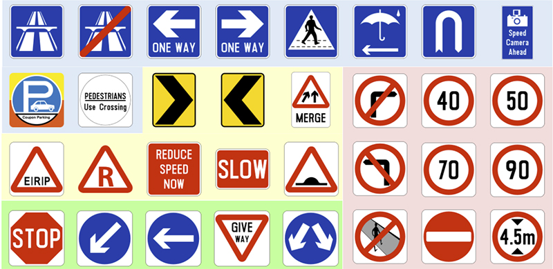
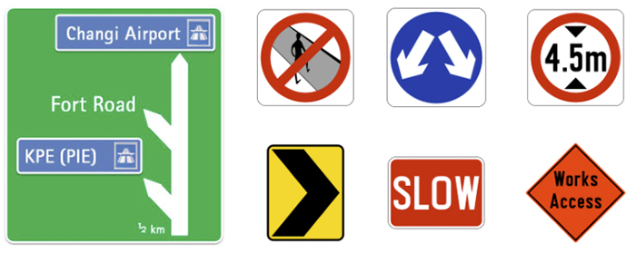
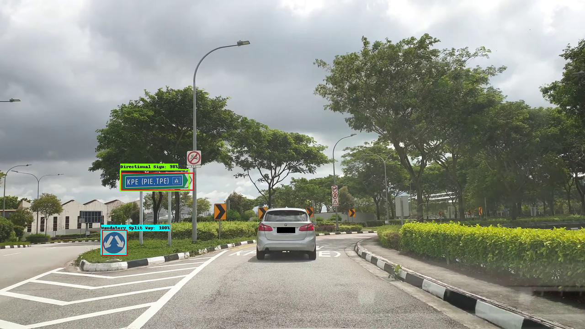
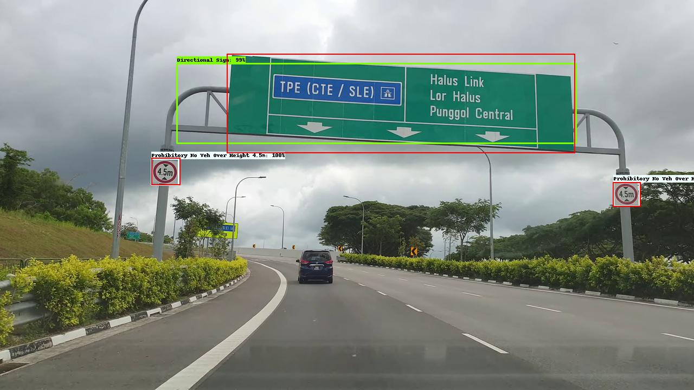
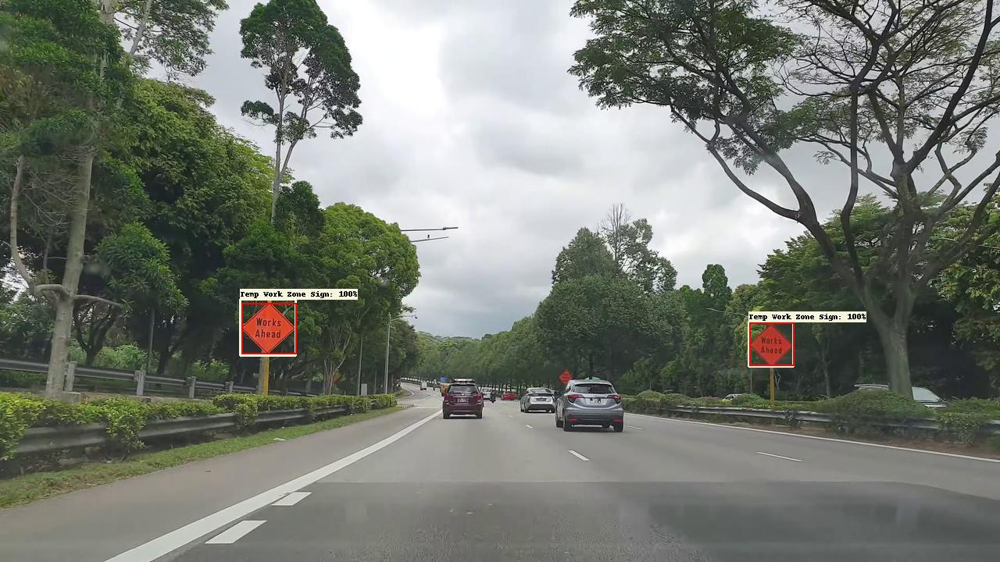
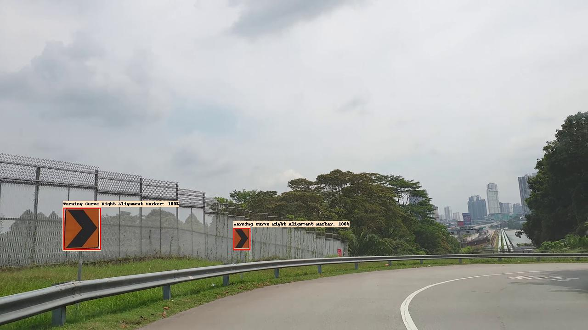
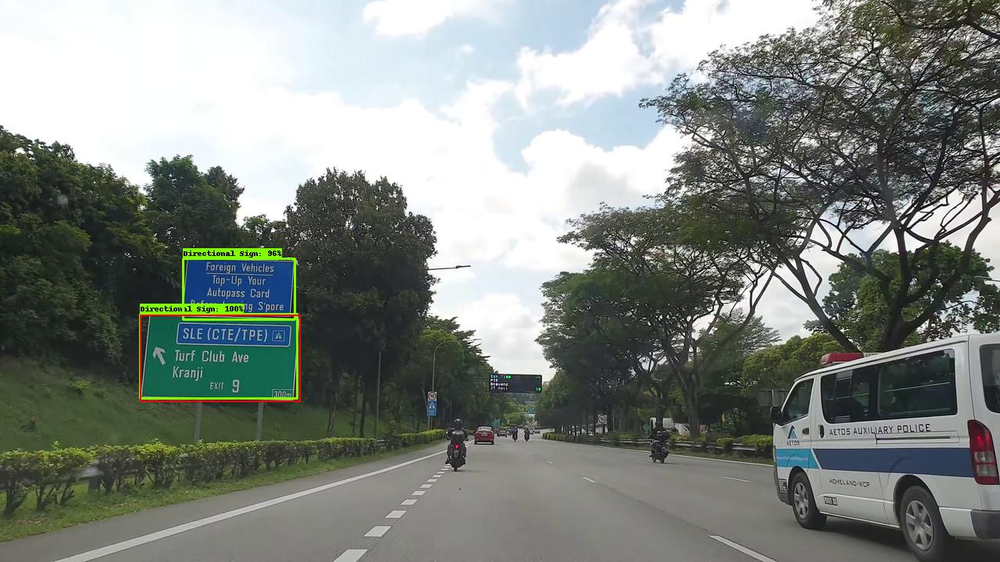
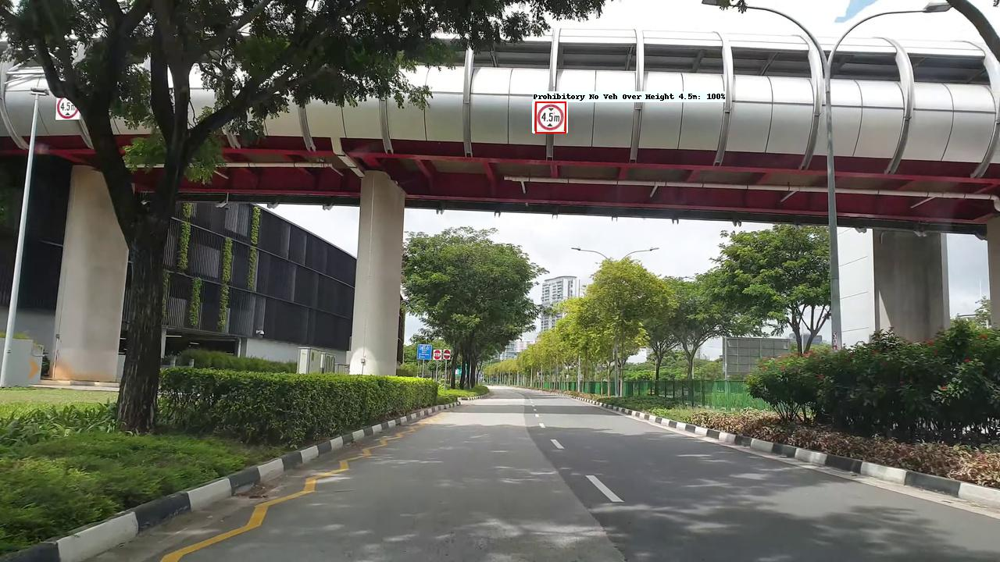

# Classification and Detection of Singapore Road Traffic Signs

## Background
In the global automotive industry today, self-driving cars, also known as autonomous vehicles, have been one of the key innovations that is brought about by accelerating adoption of artificial intelligence and robotics. An [article by The Associated Press](https://apnews.com/press-release/Wired%2520Release/79c308d2e72d77a9a755be454b3a278a) wrote that according to Allied Market Research, the global autonomous vehicle market is estimated to garner $556.67 billion by 2026 with a compound annual growth rate of 39.4% during period 2019–2026. Furthermore, [Consultancy Asia](https://www.consultancy.asia/news/3382/singapore-is-the-globes-top-country-for-autonomous-driving) wrote that KPMG released a benchmark report in mid-2020, naming Singapore as the top country in the world in terms of development of self-driving cars, as reflected in the government's policy-making and legislation efforts to encourage use of autonomous vehicles.

Not only is an AV expected to transport people and goods efficiently and safely from point-to-point, it must also comply with existing road regulations as what is expected of human drivers. One of the primary indicators of road regulations and information would be traffic signs. In Singapore, they range from the green directional signs that tell drivers about upcoming expressway exits, to warning signs that indicate potential elements of danger ahead, such as pedestrian crossings and school zones.

## Motivation
After getting my feet wet for a fair bit of time in the area of Machine Learning, I found myself being enamoured to the concept of enabling visual perception in machines to perform tasks that humans seem to do so effortlessly. This project allowed me to explore the domain of object detection, as well as the tools and frameworks that make solution implenmentation possible (with a fair bit of tinkering with environment setup). Beyond the scope of this completed project, it would continue to serve as a springboard for me to continuing exploring other areas of ML, such as data curation, model deployment and containerisation, etc. 

## Problem Statement
This project is focused on the development of both a classification model and an object-detection model as a proof-of-concept to recognise road traffic signs in Singapore, using dash-cam footage frames as a primary source of data for model training. Presentation slides found [here](https://docs.google.com/presentation/d/1oP_C2UqkV98vld1O8dlGDH-y4eUMS_WDHJ6i_D-fRTk/edit?usp=sharing).

## Executive Summary

### Classification
- For the traffic sign classification dataset, it had 2895 images, across 32 classes of traffic signs.

 *Images from [Wikipedia](https://en.wikipedia.org/wiki/Road_signs_in_Singapore)*

- Tensorflow 2 Keras framework was used to construct the models here to showcase the capability of Convolutional Neural Networks. The final model was constructed with 4 Conv2D layers with accompanying max-pooling layers to down-sample the feature map outputs from respective convolutional layers. This is followed by 3 more hidden dense layers with accompanying dropout layers as a form of regularisation to mitigate overfitting tendencies of a deep network. Early stop criteria was set to monitor training loss for stagnant over 5 epoch, but was never triggered. This time, train accuracy was 99.9%, validation at 97.3%, and **test accuracy at 90%**. All 3 accuracy metrics are well within 10% deviation of each other, and progress of validation loss and accuracy optimisation were mostly keeping pace with the training progress throughout the 50 epochs.

- Inspection of incorrect predictions on test set revealed that model was misclassified *MANDATORY_TURN_LEFT* sign as *MANDATORY_KEEP_LEFT* sign, owing to a slight tilt in the test image, as well as close similarities between both signs. This underscores the need to evaluate data augmentations carefully, and avoid using the options that might introduce ambiguity between classes. Misclassifications between *WARNING_MERGE* with *WARNING_ERP* and *WARNING_RESTRICTED_ZONE_AHEAD* indicate that the model might have insufficient training in differentiating between these warning signs, especially when the pre-dominant similarity is the red triangle on white background. Statistics on class distribution indicate that all these 3 signs have under a hundred images, hence the lack of sufficient data likely affected the model's ability to fully learn the differences in their patterns.

### Object Detection
- For the Object Detection dataset, it originally had 2554 annotations performed on 1560 images, across 57 classes of traffic signs. Class annotation was made possible by [LabelImg](https://github.com/tzutalin/labelImg), a lightweight annotation tool created by [Tzuta Lin](https://tzutalin.github.io/).

- Due to class imbalance, only 7 traffic signs that have at least 100 obervations were selected for the scope of this project. They are *Directional Sign*,*Mandatory Split Way*, *Prohibitory No Jaywalking*, *Prohibitory No Veh Over Height 4.5m*, *Temp Work Zone Sign*, *Warning Curve Right Alignment Marker*, and *Warning Slow Speed*, resulting in 767 images remaining for modeling phase.

 *Images from [Wikipedia](https://en.wikipedia.org/wiki/Road_signs_in_Singapore)*

- Model training was carried out on Google Colab environment aided by GPU-acceleration, using Tensorflow Object Detection API. Training duration was approximately 3 hours, with overall loss reaching 0.093. Trained model was evaluated to have a **mAP score of 0.758**. Inference on 76 images from *test* set was completed with a mean inference time of 45ms per image.

- The *test* set inference images revealed that model was able to detect small traffic signs and large directional signs quite accurately. False positives surfaced in the form of untrained traffic signs being identified as at least 1 of the 7 classes the model was trained for. There were a few false negatives for small traffic signs, indicating there was room to improve the recall of the model.

# Classification Model Performance Table

| Model  | Train Acc. | Validation Acc.  | Test Acc. |
|-|-|-|-|
| model_1   | 99.6% | 88.0% | 60.8%  |
| model_2   | 99.9% | 97.3% | 90.6%  |

# Object Detection Model Performance Table
Based on transfer-learning of 7 traffic signs on `ssd_mobilenet_v2_fpnlite_640x640_coco17_tpu-8` with pre-trained weights.
| Metric | Area | Dets | Score
|-|-|-|-|
|Average Precision  (AP) @[ IoU=0.50:0.95|area=all|maxDets=100|**0.758**|
|Average Precision  (AP) @[ IoU=0.50      | area=   all | maxDets=100 |0.924|
|Average Precision  (AP) @[ IoU=0.75      | area=   all | maxDets=100 | 0.880|
|Average Precision  (AP) @[ IoU=0.50:0.95 | area= small | maxDets=100 | 0.300|
|Average Precision  (AP) @[ IoU=0.50:0.95 | area=medium | maxDets=100 | 0.787|
|Average Precision  (AP) @[ IoU=0.50:0.95 | area= large | maxDets=100 | 0.708|
|Average Recall     (AR) @[ IoU=0.50:0.95 | area=   all | maxDets=  1 | 0.717|
|Average Recall     (AR) @[ IoU=0.50:0.95 | area=   all | maxDets= 10 | 0.814|
|Average Recall     (AR) @[ IoU=0.50:0.95 | area=   all | maxDets=100 | 0.814|
|Average Recall     (AR) @[ IoU=0.50:0.95 | area= small | maxDets=100 | 0.600|
|Average Recall     (AR) @[ IoU=0.50:0.95 | area=medium | maxDets=100 | 0.818|
|Average Recall     (AR) @[ IoU=0.50:0.95 | area= large | maxDets=100 | 0.867|

# Object Detection Inference samples on Test Set

**TAKE NOTE:** Red bounding box represents ground-truth, and is projected on top of predictions for visual comparison. 5th image shows a False Positive on the blue information sign.

> Written with [StackEdit](https://stackedit.io/).
